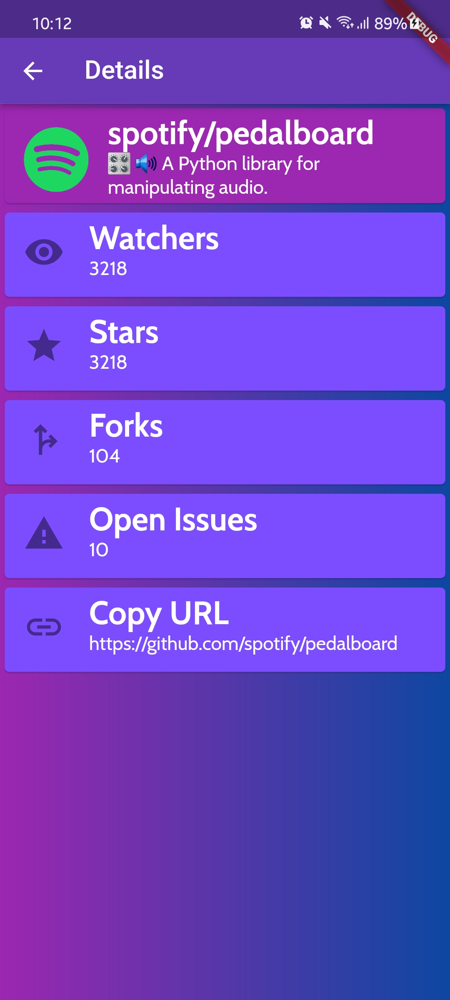

# github_explorer

GitHub Explorer is an app that gets repos information using GitHub Rest API.

## Getting Started

A few resources to get you started if this is your first Flutter project:

- [Lab: Write your first Flutter app](https://docs.flutter.dev/get-started/codelab)
- [Cookbook: Useful Flutter samples](https://docs.flutter.dev/cookbook)

# Used tools

- Visual Studio Code
- Android Studio AVD Manager

# Instructions

- 1) Download and refresh the pubsmec.yaml file to get all dependencies.
- 2) Run main.dart on your preferencial system, but this app was planned to run mainly on Android Devices.

# App Functions

- 1 In search screen you can type owner/repo and find the repository that you want, and you'll be able to click on the card in result section.

- 2 After clicking on the card you will be able to see some informations about the repository and copy the link to share or clone the repository.

# Help
For help getting started with Flutter development, view the
[online documentation](https://docs.flutter.dev/), which offers tutorials,
samples, guidance on mobile development, and a full API reference.
